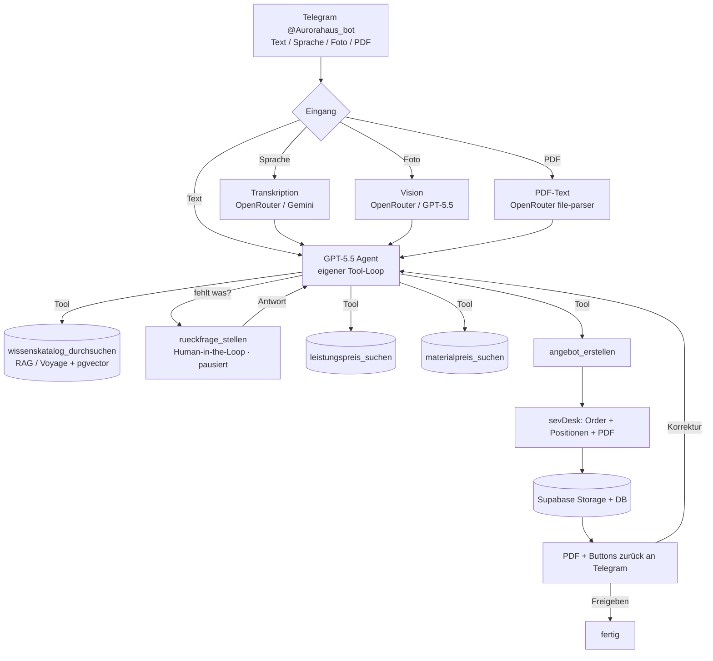

# Aurora Angebots-Bot 🏗️🤖

**Telegram-Bot, der vor Ort beim Kunden in wenigen Minuten ein Angebot kalkuliert, es in sevDesk anlegt
und als PDF zurückschickt.** Gebaut für **Aurora Haustechnik** (TGA-Komplettservice: Heizung, Klima,
Lüftung, Sanitär, Kälte, Elektro, Gebäudeautomation + Nebengewerke).

> Diese README ist bewusst ausführlich, damit jede KI-Instanz (z. B. Claude Code auf Ayses Seite) das
> System vollständig versteht und sicher weiterbauen/betreiben kann.

---

## 1. In einem Satz

Ein Monteur schickt dem Telegram-Bot **@Aurorahaus_bot** eine Text- oder **Sprachnachricht** („Wir
verlegen ein Wasserrohr unter der Küche, Fliesen müssen aufgestemmt werden …"). Eine KI (GPT-5.5 über
OpenRouter) versteht das Anliegen, prüft per **Wissenskatalog** auf Vollständigkeit, **stellt Rückfragen**,
**kalkuliert** Dienstleistung + Material aus Supabase-Katalogen, schreibt ein **Angebot in sevDesk**, legt
das **PDF in Supabase Storage** ab und schickt es zurück nach Telegram — mit Buttons **Freigeben /
Anpassen / Verwerfen**. Korrekturen per Nachricht erzeugen eine neue Version.

## 2. Live-Status

| Komponente | Wert |
|---|---|
| Telegram-Bot | **@Aurorahaus_bot** (id 8705115032) |
| Supabase-Projekt | `jobarrwnqnarahdpchfb` |
| Edge Function (Bot) | `angebotsworkflow-telegram` |
| Edge Function (Embeddings) | `angebotsworkflow-embed` |
| KI (Reasoning/Tools) | `openai/gpt-5.5` über OpenRouter |
| Transkription | `google/gemini-2.5-flash` über OpenRouter (nimmt Telegram-OGG direkt) |
| Embeddings (RAG) | Voyage `voyage-4-large` (1024 Dim) |
| Angebote | sevDesk (Order Typ `AN`, Status Entwurf) |
| Tabellen-Präfix | `angebotsworkflow_` |

**Ein OpenRouter-Schlüssel** deckt Chat + Transkription + Vision + PDF-Parsing ab (Modelle jederzeit
tauschbar). Voyage ist die einzige separate Komponente (nur Embeddings).

## 3. Architektur



**Betrieb:** Reine Supabase Edge Functions, kein eigener Server. Der Webhook antwortet sofort `200`, die
KI-Tool-Kette läuft via `EdgeRuntime.waitUntil` im Hintergrund weiter. Rückfragen pausieren den Vorgang;
der Gesprächszustand liegt in `angebotsworkflow_sessions` — die nächste Telegram-Nachricht setzt fort.

## 4. Benutzung (für Ayse / die Monteure)

1. In Telegram **@Aurorahaus_bot** öffnen, `/start` senden.
2. Vorhaben beschreiben — **tippen oder einfach reinsprechen** (Sprachnachricht). Beispiel:
   *„Angebot für Familie Schmidt, Hauptstraße 5, 35390 Gießen. Neue Dusche im Bad, alte Wanne raus,
   bodengleiche Dusche rein, ca. 4 m² Fliesen."*
3. Der Bot **fragt nach**, falls etwas fehlt (z. B. Maße, Material) — einfach antworten.
4. Der Bot schickt das **Angebots-PDF** + eine Zusammenfassung mit Buttons:
   - **✅ Freigeben** — Angebot bleibt als Entwurf in sevDesk, dort versandfertig.
   - **✏️ Anpassen** — Änderung schreiben/sprechen („Position 3 raus", „10 % Nachlass") → neue Version.
   - **❌ Verwerfen** — Angebot wird aus sevDesk gelöscht.
5. `/neu` startet einen frischen Vorgang.

Mit ⚠️ markierte Positionen sind **Annahmen** der KI (geschätzt) — vor dem Versand prüfen.

## 5. Datenmodell (alle Tabellen mit Präfix `angebotsworkflow_`)

**Kataloge (Dummy-Daten — später durch Ayses echte Daten ersetzbar):**
- `…_wissen` — Wissenskatalog/RAG: Wenn-Dann-Fragenkataloge, How-to, Normen, Leistungsübersicht.
  Vektor (1024, HNSW) **+** Trigram. (77 Dummy-Einträge)
- `…_leistungen` — Dienstleistungspreise von Aurora. Trigram-Suche. (133 Dummy-Positionen)
- `…_material` — Materialpreise (Lieferantenpositionen), sync-ready. Trigram-Suche. (263 Dummy-Positionen)
  Verkaufspreis = `einkaufspreis_netto × aufschlag_faktor` (generierte Spalte).

**Betrieb:**
- `…_kunden` — Kundenspiegel zu sevDesk (`sevdesk_contact_id`).
- `…_angebote` — erstellte Angebote (sevDesk-Nr, Summe, Status, Version, PDF-Pfad, KI-Annahmen).
- `…_angebote_positionen` — Angebotspositionen (Menge, Einheit, Preis, Kategorie, `is_assumption`).
- `…_vorgaenge` — Audit je Angebotsvorgang: Roh-Eingaben, Wissens-Treffer, Rückfragen, Kalkulation, PDF.
- `…_sessions` — Live-Gesprächszustand (`current_state.messages` = laufende KI-Konversation).
- `…_audit_log` — Event-Log jeder Aktion/jedes Tools/Fehlers (Debugging).
- `…_allowed_users` — Whitelist erlaubter Telegram-User-IDs (zusätzlich zur env `TELEGRAM_ALLOWED_USER_IDS`).
- `…_config` — Stellschrauben ohne Code-Deploy (s. u.).
- `…_secrets` — Runtime-Secrets (service-role-only; Konvenienz, s. Sicherheit).

**RAG-Funktionen (RPC):** `angebotsworkflow_match_wissen/_leistungen/_material` (Vektor) und
`angebotsworkflow_search_leistungen/_material` (Trigram). **Storage-Bucket:** `angebotsworkflow-angebote` (privat).

## 6. KI-Werkzeuge (Function-Calling)

Die KI orchestriert selbst, welche Tools in welcher Reihenfolge:
`wissenskatalog_durchsuchen`, `leistungspreis_suchen`, `materialpreis_suchen`,
`material_live_recherche` (optional, Flag-gesteuert, Standard AUS), `rueckfrage_stellen` (Human-in-the-Loop),
`angebot_erstellen` (sevDesk + Storage + DB + Telegram-PDF; mit `basis_angebot_id` für Korrekturen).

## 7. Konfiguration ohne Code-Deploy (`angebotsworkflow_config`)

| Key | Bedeutung |
|---|---|
| `llm_model` / `transcribe_model` / `vision_model` | OpenRouter-Modelle (z. B. `openai/gpt-5.5`) |
| `stundensaetze_netto` | `{ "helfer":58, "monteur":72, "meister":95 }` |
| `anfahrtspauschale_netto`, `material_aufschlag_faktor` | Kalkulationsparameter |
| `agk_prozent`, `wg_prozent`, `mwst_prozent` | Zuschläge / Steuer |
| `material_live_recherche_enabled` | Live-Webrecherche als Fallback (Standard `false`) |

Ändern z. B. per SQL: `update angebotsworkflow_config set value='"openai/gpt-5.6"' where key='llm_model';`

## 8. Secrets

Die Funktion liest Secrets **env-first**, sonst aus `angebotsworkflow_secrets`. Aktuell genutzt:
- **Projektweite Supabase Edge Secrets** (aus dem bestehenden Aurora-Setup): `TELEGRAM_BOT_TOKEN`
  (@Aurorahaus_bot), `TELEGRAM_WEBHOOK_SECRET`, `SEVDESK_API_TOKEN`, `TELEGRAM_ALLOWED_USER_IDS`.
- **`angebotsworkflow_secrets`-Tabelle** (für den Neubau gesetzt): `secret_openrouter_api_key`,
  `secret_voyage_api_key`, `secret_admin_key` (+ optional Telegram/sevDesk-Overrides).

> **Sicherheitshinweis:** Secrets in der DB sind eine Konvenienz für den autonomen Betrieb (nur über
> service-role lesbar, RLS aktiv). Für maximale Härtung später auf **Supabase Edge Secrets** umziehen
> (`supabase secrets set …`) und die DB-Zeilen löschen — die Funktion bevorzugt dann automatisch env.

## 9. Admin-Endpunkte (Header `x-admin-key: <secret_admin_key>`)

Ermöglichen Setup/Wartung ohne Kenntnis der projektweiten Secrets:
- `POST …/angebotsworkflow-telegram?admin=whoami` → Bot-Identität.
- `POST …?admin=webhookinfo` → Webhook-Status.
- `POST …?admin=setwebhook` → registriert den Webhook auf diese Function (eigenes Secret).
- `POST …?admin=test` (Body = Telegram-Update-JSON) → injiziert einen Vorgang (Smoke-Test).

## 10. Deploy / Re-Deploy

Das Aurora-Supabase-Projekt ist über den **Supabase-MCP** erreichbar (nicht über jede lokale CLI-Anmeldung).
Zwei Wege:
- **MCP** (`deploy_edge_function`) — so wurde initial deployed.
- **CLI** (wenn die richtige Account-Anmeldung vorliegt):
  ```bash
  supabase functions deploy angebotsworkflow-telegram --no-verify-jwt --project-ref jobarrwnqnarahdpchfb
  supabase functions deploy angebotsworkflow-embed --project-ref jobarrwnqnarahdpchfb
  ```
Migrationen liegen konzeptionell in `db/` (Schema-Snapshot); sie wurden via MCP `apply_migration` angewandt.

## 11. Go-Live (Aktivierung)

1. Secrets prüfen (s. 8). 2. Webhook setzen: `?admin=setwebhook` aufrufen (oder Telegram `setWebhook`).
3. Whitelist prüfen: `select * from angebotsworkflow_allowed_users;` + env `TELEGRAM_ALLOWED_USER_IDS`.
4. In Telegram **@Aurorahaus_bot** `/start` senden und einen Vorgang testen.

## 12. Tests

- DB-Schema, Kataloge (133 Leistungen, 263 Material) + Such-RPCs verifiziert.
- RAG-Suche verifiziert (semantische Treffer für das Rohr-/Fliesen-Szenario).
- OpenRouter: GPT-5.5 Tool-Calling, Gemini-Transkription (OGG), Voyage-Embeddings verifiziert.
- Code-Review (interner Critic + externe QA über Drittmodell) — Befunde eingearbeitet.
- E2E-Smoke-Test über `?admin=test` (synthetischer Vorgang) — s. `docs/`.

## 13. Troubleshooting

- **Bot antwortet nicht:** Webhook gesetzt? (`?admin=webhookinfo`) · User in Whitelist? · `…_audit_log` ansehen.
- **`missing secrets`-500:** ein boot-kritisches Secret fehlt (OpenRouter/Voyage/sevDesk/Webhook-Secret/Supabase).
- **Fehler in einem Schritt:** `select * from angebotsworkflow_audit_log where event_type='error' order by created_at desc;`
- **Embeddings fehlen nach Katalog-Update:** `?admin=` n/a → `angebotsworkflow-embed` aufrufen (Body `{"table":"wissen"}`).

## 14. Dummy-Daten durch echte ersetzen

Kataloge sind normale Tabellen. Zeilen austauschen (SQL/CSV/PostgREST), dann **für `…_wissen`** einmal
`angebotsworkflow-embed` aufrufen (erzeugt fehlende Embeddings). Leistungen/Material brauchen keine
Embeddings (Trigram-Suche). Struktur & Beispiele: `seeds/*.json`.

## 15. Verzeichnis

```
functions/angebotsworkflow-telegram/index.ts   # Bot + Agent-Loop (Haupt-Function)
functions/angebotsworkflow-embed/index.ts       # Embedding-Wartung (Voyage)
seeds/                                           # Dummy-Kataloge (JSON) + Lade-/Test-Skripte
db/                                              # SQL-Schema-Snapshot (Migrationen)
docs/sevdesk-angebot-ablauf.md                   # sevDesk API-Notation
docs/BETRIEBSANLEITUNG.md                        # Kurzanleitung für Ayse
```

## 16. Roadmap / bewusst offen

- **Live-Materialrecherche** (Tool vorhanden, Standard AUS) → später Hersteller-Scraping/Tages-Sync.
- **Eigene Aurora-Keys** für OpenRouter/Voyage statt Shared-Keys.
- **Warenwirtschaft** (Lagerbestand statt nur Preise) — zukünftig.
- Härtung: DB-Secrets → Edge Secrets/Vault.

---
*Gebaut mit Claude Code. Stand: Juni 2026.*
